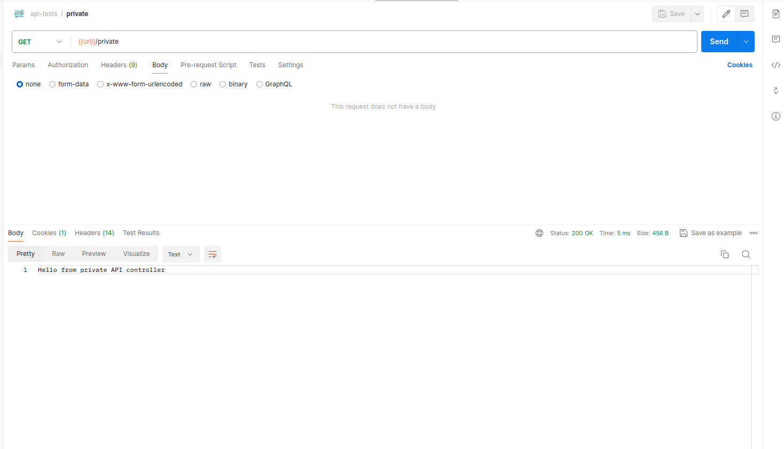

<h1 align="center">
  Teste utilizando 
</h1>

## Tecnologias
 
- Jakarta EE 17 (Java)
- [Spring Boot](https://spring.io/projects/spring-boot)
- [Spring MVC](https://docs.spring.io/spring-framework/reference/web/webmvc.html)
- [Spring Security](https://spring.io/projects/spring-security)
- [Spring Data JPA](https://spring.io/projects/spring-data-jpa)
- [Postgresql docs](https://www.postgresql.org/docs/)
- [Docker](https://docs.docker.com/)
- [Docker Compose](https://docs.docker.com/compose/)
- [Flyway](https://documentation.red-gate.com/flyway/getting-started-with-flyway)

## Como Executar
- Clonar repositório git:
```
git clone https://github.com/eduado-villasboas/spring-resource.git
```
- Configurar ambiente

Na raiz do projeto execute para subir o banco de dados.
```bash
docker compose -f compose.yaml up -d --build
```
- Construir o projeto:
```
./mvnw clean package
```

- Executar com java -jar:
```bash
java -jar ./target/spring-resource-0.0.1-SNAPSHOT.jar
```
### obs: Para subir atravez do comando java -jar é preciso subir o banco através do arquivo compose.yaml na raiz do projeto

- Executar com o plugin do maven
```bash
 ./mvnw spring-boot:run
```
### obs: Através desse método não é necessário subir o container do banco pois o mesmo deveria ser iniciado automaticamente. Porém, ao se enfrentar qualquer problema de conexão é aconselhado que você suba o container manualmente. Outra observação importante é garantir que não existe nenhum outro programa conectado na porta 5454, pois essa porta é a porta que o compose.yaml configura do banco postgresql local


- Importar a collection do postman e o arquivo de variáveis de ambiente disponíveis na pasta **postman** na raiz do projeto executar o endpoint de atenticação depois o endpoint para acessar o recurso privado
Respectivamente
- authenticate
- private

Resultados esperados

authenticate


private


# Desafio

O desafio proposta é criar uma API que cria um recurso no qual podemos adicionar tags

- Operações a serem implementadas
  - Criação do recurso [new-resource](#new-resource) 
  - Listagem de recursos por nome, tag ou por ambos [resource-list](#list-resources)
  - Adição de tags a um recurso específico [new-tags](#new-tags)
  - Deleção do recurso [delete-resource](#delete-resource)
  - Deleção de tags [delete-tags](#delete-tags)

Obs: 
- No total serão 5 endpoints
- Os ids das entidades não devem ser retornados pelos endpoints
- A entidade recurso(resource) deve ter um campo de data de criação e data de atualização que deve sempre ser retornada no body de resposta
- Dentro da pasta resources/static/ existe uma definição do swagger com requests e responses a fim de facilitar as implementações. O site do [swagger editor](https://editor.swagger.io/) fornece uma interface amigável para visualizar essa documentação e você também pode acessar essa documentação através da url http://localhost:8080/api/swagger-ui/index.html, lembrando que é preciso authenticar para acessar esse recurso também e o usuário e senha padrão são respectivamente "usuario" e "password" sem aspas

## Definição das regras

### new-resource
- Um recurso deve ser único. Ou seja, não podemos ter dois recursos com o mesmo nome(name)
- O endpoint deve retornar 201 juntamente com a entidade recém criada no banco

### list-resources
- O endpoint deve ser paginado e os filtros de nome e tag devem ser opcionais
- O endpoint deve ser ordenado pela data de atualização em ordem decrescente
- O endpoint deve retornar um 200

### new-tags
- O endpoint deve retornar um 200
- O endpoint deve retornar o recurso com todas as tags inclusive as tags recém inseridas
- As tags devem ser únicas para de um recurso

### delete-resource
- O endpoint deve retornar um 204
- O endpoint não deve retornar um body

### delete-tags
- O endpoint deve retornar um 200 em caso de sucesso
- O endpoint deve retornar o recurso recém-atualizado com todas as tags contidas no banco 


<h1> Créditos: </h1>

Este projeto utilizou o projeto [github](https://github.com/giuliana-bezerra/spring-security-jwt.git) como ponto de partida.
<p align="center">
 
 
</p>

Tutorial apresentado [nesse vídeo](https://youtu.be/kEJ8a1w4a2Q) para ilustrar como implementar uma autenticação e autorização com Spring Security e JWT.
